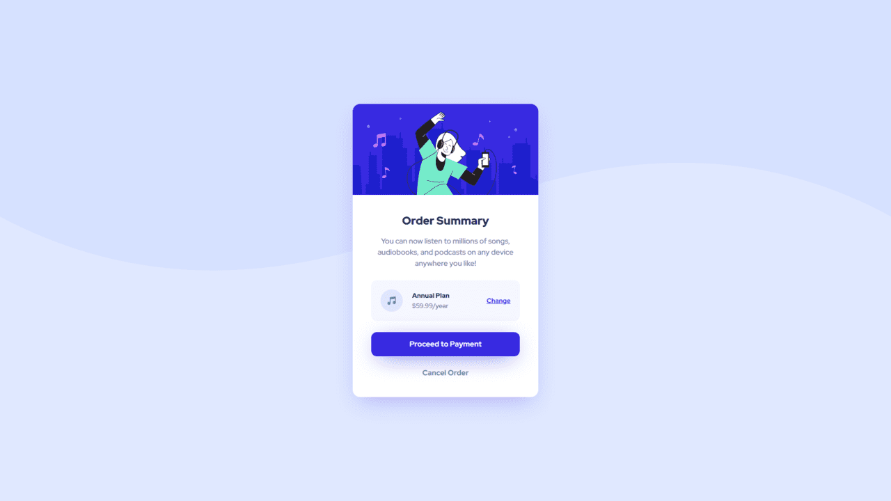

# Frontend Mentor - Order summary card solution

This is a solution to the [Order summary card challenge on Frontend Mentor](https://www.frontendmentor.io/challenges/order-summary-component-QlPmajDUj). Frontend Mentor challenges help you improve your coding skills by building realistic projects.

## Table of contents

- [Overview](#overview)
  - [The challenge](#the-challenge)
  - [Screenshot](#screenshot)
  - [Links](#links)
- [My process](#my-process)
  - [Built with](#built-with)
  - [What I learned](#what-i-learned)
  - [Useful resources](#useful-resources)
- [Author](#author)

## Overview

### The challenge

Users should be able to:

- See hover states for interactive elements

### Screenshot



### Links

- Solution URL: [https://www.frontendmentor.io/solutions/order-summary-component-with-tailwind-css-grEcynvdj8](https://www.frontendmentor.io/solutions/order-summary-component-with-tailwind-css-grEcynvdj8)
- Live Site URL: [https://ninhos0.github.io/order-summary-component-main/](https://ninhos0.github.io/order-summary-component-main/)

## My process

### Built with

- Semantic HTML5 markup
- Flexbox
- CSS Grid
- Mobile-first workflow
- [Tailwind CSS](https://tailwindcss.com/) - For styles

### What I learned

I learned how to implement and configure tailwind css for my project patterns, as in this project I applied the colors provided for the application in the tailwind css settings, like the example below:

```html
<script>
  tailwind.config = {
    theme: {
      extend: {
        colors: {
          Paleblue: "hsl(225, 100%, 94%)",
          Brightblue: "hsl(245, 75%, 52%)",
          Verypaleblue: "hsl(225, 100%, 98%)",
          Desaturatedblue: "hsl(224, 23%, 55%)",
          Darkblue: "hsl(223, 47%, 23%)",
        },
        boxShadow: {
          button: "0 10px 50px -15px rgba(0, 0, 0, 0.15);",
          main: "0 20px 50px -15px rgb(56, 41, 224, 0.3);",
        },
      },
    },
  };
</script>
```

### Useful resources

- [Tailwind](https://tailwindcss.com/) - Tailwind helped me with the styling process for my project.

## Author

- Website - [My Portfolio](https://portifoliov2-client.vercel.app/)
- Frontend Mentor - [@N1NHOS0](https://www.frontendmentor.io/profile/NINHOS0)
- Linkedin - [My Linkedin](https://www.linkedin.com/in/renan-polido-805a66248/)
